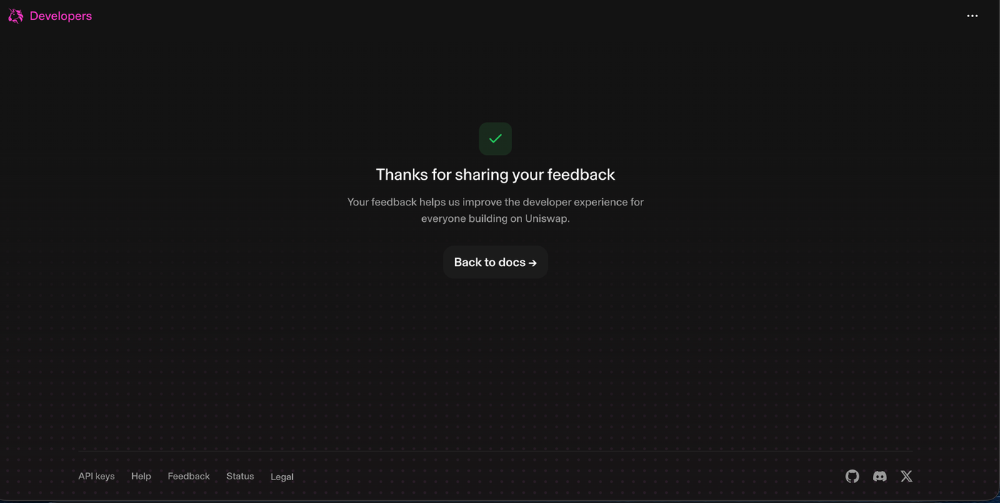

# Uniswap Trading API — Developer Feedback

Written while building **HumanMandate** at ETHGlobal Lisbon 2026. Everything below
happened to us on World Chain mainnet (chain 480); nothing here is hypothetical.

## What we built with it

Two things, and the second one is where the interesting feedback is.

**A plain CLI.** [`scripts/swap.ts`](scripts/swap.ts) runs the documented
`check_approval → quote → swap → broadcast` flow against
`https://trade-api.gateway.uniswap.org/v1`, gated behind `TRADE_CONFIRM=yes` so no
trade fires without a human deciding on that exact quote.

**A settlement contract that sits between the payer and the router.**
[`contracts/src/MandateSwapper.sol`](contracts/src/MandateSwapper.sol) lets an AI
agent, which holds a capped spending mandate, convert what it is allowed to spend
into the asset the human chose. The agent supplies route calldata it fetched from
the Trading API; the contract executes it and enforces its own guarantee on the
result.

## What worked well

Three endpoints cover the entire flow. The JSON is plain to parse and the quote
response spreads almost directly into the `/swap` body, so no SDK was needed, a
REST client was enough. Any EVM chain is just a `chainId` argument, and World Chain
worked first try with no special casing.

## The biggest gap: executing a route from your own contract

Every doc and example we found covers the same topology: a wallet quotes for
itself, then sends the router calldata itself. Our product needs a different one.
The agent triggers the payment, the contract holds the funds, and a third party
receives the output.

Nothing told us how to do that. We had to work out by trial on mainnet:

- **which address to request the quote for.** The `swapper` field has to be the
  contract, not the wallet that pays gas, or the returned calldata moves the wrong
  balance.
- **where the Permit2 approvals sit.** The contract has to approve Permit2, and
  then Permit2 has to approve the Universal Router, before any route will execute.
  Neither step appears in the wallet-side flow because the wallet does it in the UI.
- **how to keep a guarantee around opaque calldata.** Once you hand arbitrary
  router calldata to a router, you have given up knowing what happened. We measure
  the payee's balance before and after and revert below a floor, because that is the
  only thing we could still verify.

A short recipe titled something like *"execute a Trading API route through your own
settlement contract"* would have saved us most of a day, and it is exactly the shape
agent and custody products need.

## The insight we wish the docs had led with

**A spending cap means nothing once a swap sits in the middle.**

A cap counts what *leaves* the payer. Put a swap between the agent and the payee and
the agent can stay under that cap forever and still drain value by settling through
a poor route, or by sandwiching itself. The amount spent looks obedient. The amount
received does not.

The quote is advice. Nothing enforces it. And in an agentic setup it is the agent,
not the human, choosing both the timing and the route.

Our answer was to measure what the payee actually receives inside the settlement
contract and revert below a declared floor. That refusal is live on mainnet:

```
SlippageTooHigh(received 939042, minOut 1878084)
0x354bd1260bb7a456215a7b4ffe0b515cef16e533c0ebd17de0bdf9afaec4ea1f
```

and the same call with an honest floor settled, paying the payee 0.939127 USDC.e:

```
0x33ad7da0b934af549ebaebddaeef7e8efa80371f70280504eb629fb6bbef09a5
```

Making `minOut` a first-class, documented concept for contract-mediated execution
would make agentic integrations safer by default.

**Where we are still imperfect, stated rather than hidden.** Our `settle` takes the
contract's whole `tokenIn` balance as its input and only measures the output as a
delta, so two mandates holding the same token at once could cross. Per-mandate input
accounting is designed but was not built in time. It is disclosed in the contract's
own natspec rather than papered over.

## Friction points in the API itself

**Expired quotes come back looking like success.** This cost us the most time. A
stale quote does not produce an HTTP error. `/swap` returns 200 with empty calldata,
and nothing tells you the quote is the problem, so you debug your own code first. We
added a guard:

```ts
if (!swap?.data || swap.data === '0x' || !isHex(swap.data))
  throw new Error('swap.data empty/invalid — quote expired, re-run');
```

**Two incompatible response shapes behind one `routing` field.** UniswapX quotes
carry `quote.orderInfo.outputs[0].{startAmount,endAmount}`; Classic quotes carry
`quote.output.amount`. There is no common field for "the output amount", so every
caller reimplements the branch.

**`/swap` accepts different payloads per routing type, and the response does not say
so.** UniswapX must NOT receive `permitData` back. Classic needs both `permitData`
and the signature, or neither. We strip both fields out of every quote and re-attach
them only for Classic. That rule is not discoverable from the response itself.

**Approval is a second confirmed transaction, not a signature.** `/check_approval`
can return an on-chain approval tx that must land before `/swap` is even called, so
a first-time Classic swap is two confirmed transactions. That changes both UX and
demo timing, and it surprised us.

**Error shape is not guaranteed.** Our client falls back to
`JSON.stringify(data).slice(0, 300)` when `data.detail` is missing, because not
every failure carries a `detail` field.

## Suggestions

1. Publish a recipe for executing a route through a caller-owned contract: which
   address to quote for, the Permit2 approval topology, and how to verify the result.
2. Treat `minOut` as first-class for that path. Right now the floor is whatever the
   caller passes, which in an agentic setup is the party the floor exists to constrain.
3. Normalise `/quote` so the output amount and gas fee live at one stable path
   regardless of routing.
4. Document, or better, have the API ignore, the `/swap` fields that are invalid for
   a given routing type instead of making callers strip them.
5. Return a distinct expired-quote error rather than a 200 with empty calldata.
6. Guarantee `detail`, or an equivalent, on every error response.

## Where to verify our integration

| What | File | Lines |
|---|---|---|
| Trading API `/quote` and `/swap` calls | [`scripts/swap.ts`](scripts/swap.ts) | 21, 95, 143 |
| Routing-aware `/swap` body (UniswapX vs Classic) | [`scripts/swap.ts`](scripts/swap.ts) | 67–79 |
| Expired-quote guard | [`scripts/swap.ts`](scripts/swap.ts) | 145 |
| Output floor enforced on the measured delta | [`contracts/src/MandateSwapper.sol`](contracts/src/MandateSwapper.sol) | 154–159 |
| Router immutable, so the agent cannot name its own | [`contracts/src/MandateSwapper.sol`](contracts/src/MandateSwapper.sol) | 61 |
| Permit2 approval topology | [`contracts/src/MandateSwapper.sol`](contracts/src/MandateSwapper.sol) | 123–132 |

`MandateSwapper` on World Chain mainnet: `0x4054fC0708799B906276984575cDfaBbe1Df45e9`

## Form submission

This feedback was also submitted through the Uniswap Developer Feedback Form at
`https://developers.uniswap.org/hackathon-feedback`, with a link back to this file.


