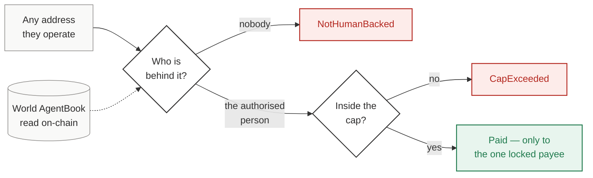
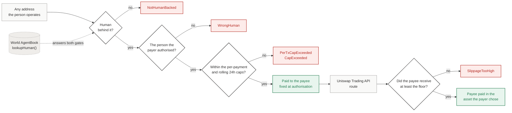

# HumanMandate

**An allowance bound to a person, not an address.**

We do **not** issue Proof of Human. We **enforce spending rules** for a unique human that World already attested ([Achieving Proof of Human](https://whitepaper.world.org/achieving-proof-of-human) Stage 3 — authentication / relying party).

Credit cards bind to a card. ERC-20 allowances bind to an address. Revoke either and the counterparty spins up a new credential.

HumanMandate binds authority to a **World AgentBook `humanId`** and enforces it in Solidity:

- The rolling 24h cap belongs to the **person** — two of their agents share one budget
- Revoke cuts off the **person** — a brand-new agent address still reverts
- Raising the cap or moving the payee requires a **fresh Selfie Check**. Routine spend inside the cap does not
- Spending can be **converted through Uniswap** without widening what may be spent

Built at **ETHGlobal Lisbon 2026**.

## How it works

Every branch that ends in a refusal is a real mainnet transaction, linked further down.



Revoking cuts off the **person**. They come back tomorrow on a brand-new address and enter at the same first gate — and are refused again.

Two properties fall out of this shape:

**The budget belongs to the person.** Two different addresses operated by the same human draw on one rolling cap, and revoking cuts off every address that person will ever open.

## Why this is new

Projects on [agentbook.world](https://agentbook.world) use AgentKit to gate **HTTP** endpoints. None we measured use AgentBook inside a contract to guard **money**. We read the live AgentBook from Solidity and revert on-chain.

## Live on World Chain mainnet

| Contract | Address |
|---|---|
| **HumanMandate** | [`0x7fcEc100ADc4e89b09a92e3f7931161791D06054`](https://worldchain-mainnet.explorer.alchemy.com/address/0x7fcEc100ADc4e89b09a92e3f7931161791D06054) |
| **MandateSwapper** | [`0x4054fC0708799B906276984575cDfaBbe1Df45e9`](https://worldchain-mainnet.explorer.alchemy.com/address/0x4054fC0708799B906276984575cDfaBbe1Df45e9) |
| **AgentBookRegistry** | [`0x9Ac36746eFbb8192b0D5BB8C0774026bff1b9aB4`](https://worldchain-mainnet.explorer.alchemy.com/address/0x9Ac36746eFbb8192b0D5BB8C0774026bff1b9aB4) |
| World AgentBook (official) | `0xA23aB2712eA7BBa896930544C7d6636a96b944dA` |

### The mandate, proved on one contract

A revert here is a **designed refusal**, mined deliberately so it can be verified. Every selector was recovered with `cast run` and matched against `cast sig` — not guessed.

| What it proves | Result | Tx |
|---|---|---|
| An address the mandate **never named** spends anyway | ok | [`0xb7fa49a1…4620`](https://worldchain-mainnet.explorer.alchemy.com/tx/0xb7fa49a1a4a08774ea6a470e50c2aa23a7645906d4b630e38fd9e6764bc44620) |
| A wallet with **no human** behind it | `0x203ac8ca NotHumanBacked` | [`0x9ebb088a…1f0e`](https://worldchain-mainnet.explorer.alchemy.com/tx/0x9ebb088a3a91b11d110c8c396083ff1cdb34863f6c4bffa926834e8e9ae81f0e) |
| A second agent of the same person shares the budget | ok | [`0x7da5b4ba…767e`](https://worldchain-mainnet.explorer.alchemy.com/tx/0x7da5b4ba0d69c3d819f3ca43c5e0b4e395c02aa9fded20a6cb5650065436767e) |
| One payment over the per-payment cap | `0xcb0bcbd5 PerTxCapExceeded` | [`0x33e79b96…c650`](https://worldchain-mainnet.explorer.alchemy.com/tx/0x33e79b96d1035ed533e097566456af6a6a38846f032e8d966e1cb6d4288cb650) |
| One wei past the rolling 24h cap | `0x2e8b3b3b CapExceeded` | [`0xe91dcc5f…f2be`](https://worldchain-mainnet.explorer.alchemy.com/tx/0xe91dcc5f00fafbed9154e6952689f6a155604511992187608b95c1aa4d54f2be) |
| Raising the limit with no Selfie Check | `0x6aaa9349 LivenessRequired` | [`0x61f5ccf4…cdd5`](https://worldchain-mainnet.explorer.alchemy.com/tx/0x61f5ccf45deaa8f40712b769fd44f50b8a614dc38f05b51253dc00045911cdd5) |
| Raising it with a fresh attestation | ok | [`0xb1e64600…e603`](https://worldchain-mainnet.explorer.alchemy.com/tx/0xb1e646009690254f768a3706204639e47b0bfda01261e9ab2d268941bc24e603) |
| Replaying that attestation | `0x6c866211 LivenessAlreadyUsed` | [`0x1fa5fa90…11dc`](https://worldchain-mainnet.explorer.alchemy.com/tx/0x1fa5fa9072c5a58e9f0e147f5e8a1fe326b1c7cb5287ed57bc4044ebff8c11dc) |
| The revoked person returns on a fresh address | `0xa4e1a97e NotAuthorized` | [`0x23db1c10…5dab`](https://worldchain-mainnet.explorer.alchemy.com/tx/0x23db1c10f5108d9d9ef930da742dd9fee9246d4293591ebe15775d51db115dab) |

Rows one and two are the discriminating pair. Either alone proves nothing; together they prove the registry read is the actual gate.

## Uniswap integration

**Where the money is spent.** A mandate on its own moves one token to one payee. `MandateSwapper` lets a mandated agent convert what it is allowed to spend into the asset the payer chose, routed by the **Uniswap Trading API**, without widening what it may spend.

**Developer feedback for this integration:** [`FEEDBACK.md`](FEEDBACK.md).

**The problem this exists to solve.** A cap counts what *leaves* the payer. Put a swap in the middle and an agent can stay under the cap forever while still draining value — route through a bad pool, or sandwich itself. The amount spent looks obedient; the amount received does not. **A cap with no floor on the output is not a cap.**

The whole path, both contracts:



So the contract measures the *actual* balance delta and refuses below the floor:

| Where | File | Lines |
|---|---|---|
| Output floor enforced on the measured delta | [`contracts/src/MandateSwapper.sol`](contracts/src/MandateSwapper.sol) | **154–159** |
| Router is immutable (the agent cannot name its own "router") | [`contracts/src/MandateSwapper.sol`](contracts/src/MandateSwapper.sol) | 61 |
| Payer fixes the asset and payee; the agent picks only timing and route | [`contracts/src/MandateSwapper.sol`](contracts/src/MandateSwapper.sol) | 81–92 |
| Trading API `/quote` and `/swap` calls | [`scripts/swap.ts`](scripts/swap.ts) | 21, 95, 143 |
| Routing-aware `/swap` body (UniswapX vs CLASSIC) | [`scripts/swap.ts`](scripts/swap.ts) | 67–79 |
| AgentBook read that gates every spend | [`contracts/src/HumanMandate.sol`](contracts/src/HumanMandate.sol) | 105–111, 210–212 |

### Proved on-chain

Real route from the Trading API (`CLASSIC`, 526 bytes of calldata), real liquidity, real refusal.

| Step | Result | Tx |
|---|---|---|
| Payer opens the mandate, paying out to the swapper | ok | [`0xf8c784f4…3d6e`](https://worldchain-mainnet.explorer.alchemy.com/tx/0xf8c784f4f8b386468a60211103cf97b68c8efda28af3916db2979f410b1f3d6e) |
| Payer declares what it converts into, and who receives it | ok | [`0x64d5c3c2…914f`](https://worldchain-mainnet.explorer.alchemy.com/tx/0x64d5c3c2ec7132ede57e4cf19ce4f37a9f1db0a175cba49475b9fbdf28fc914f) |
| The agent spends 0.0005 WETH, under the cap | ok | [`0x92cf187c…8473`](https://worldchain-mainnet.explorer.alchemy.com/tx/0x92cf187cd3be1d42e7300c7ae209d340f581320d3bf19ef6f39567d950118473) |
| **Settle demanding a floor the route cannot pay** | `0x76baadda SlippageTooHigh` | [`0x354bd126…4ea1f`](https://worldchain-mainnet.explorer.alchemy.com/tx/0x354bd1260bb7a456215a7b4ffe0b515cef16e533c0ebd17de0bdf9afaec4ea1f) |
| Settle with an honest floor — payee receives 0.939127 USDC.e | ok | [`0x33ad7da0…09a5`](https://worldchain-mainnet.explorer.alchemy.com/tx/0x33ad7da0b934af549ebaebddaeef7e8efa80371f70280504eb629fb6bbef09a5) |

The refusal is the point. Quoted output was 939042 base units; demanding 1878084 was refused with both figures in the revert data.

Developer feedback for this integration: [`FEEDBACK.md`](FEEDBACK.md).

## Tests

```sh
cd contracts
./bootstrap.sh     # pinned forge-std + OpenZeppelin, ~11 MB
forge test
```

**48/48 passing**, including 4 fork tests against the live World Chain AgentBook (pinned block 32845385). The one that matters most:

- `test_a_bad_route_is_refused_even_though_the_cap_was_respected` — the cap is obeyed and the transaction is still refused

## AI usage disclosure

Built with Claude Code / Cursor as pair programmers for scaffolding, tests, and doc-driven integration. Architecture, product calls, and verification of every on-chain claim were made by the team. Every transaction hash in this README was executed for real.
